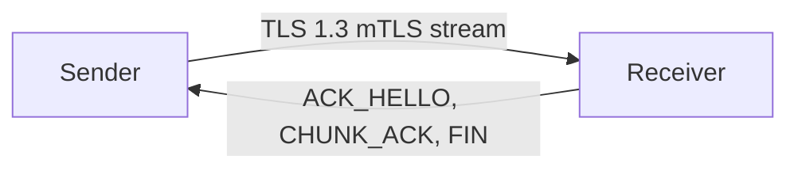

# DESIGN1: Approach A - mTLS 1.3 Direct Streaming

## Goal

Transfer one 4 GB file directly from sender to receiver over an untrusted Internet while preserving confidentiality, integrity, authentication, and availability. This approach uses transport-layer security: the receiver runs a TLS 1.3 server, the sender connects as a TLS client, and both sides authenticate each other with mutual TLS.

## Trust Setup

A small project certificate authority is generated once for the demo. The CA signs two leaf certificates: one for the sender and one for the receiver. Each endpoint has its own private key and certificate plus the CA certificate used to verify the peer. The CA private key is not shipped to either endpoint. This models an organization or course staff distributing certificates before the transfer.

## Architecture

The receiver listens on `127.0.0.1:9443` with TLS client-certificate verification required. The sender verifies the receiver certificate against the pinned project CA, then streams the file in fixed-size chunks inside the TLS connection. A small binary framing protocol runs inside TLS so the application can negotiate resume offsets, acknowledge progress, and verify the final plaintext hash.



## Protocol

All frames are length-prefixed binary messages inside TLS:

- `HELLO`: sender provides protocol version, file ID, total size, filename, and plaintext SHA-256.
- `ACK_HELLO`: receiver returns the resume offset, either zero or the last contiguous byte written.
- `CHUNK`: sender transmits sequence number, byte offset, length, and file bytes.
- `CHUNK_ACK`: receiver periodically acknowledges accepted sequence numbers.
- `DONE`: sender repeats total chunk count and plaintext SHA-256.
- `FIN`: receiver returns `OK`, `HASH_MISMATCH`, or `ABORT`.

The receiver writes to `{file_id}.partial` and records `{file_id}.state` with the last contiguous offset. On reconnect, the sender uses the same file ID, seeks to the returned offset, and continues.

## CIAA Summary

- Confidentiality: TLS 1.3 encrypts the stream with an AEAD cipher negotiated by `ssl`, such as AES-GCM or ChaCha20-Poly1305.
- Integrity: TLS record authentication detects network tampering; the final plaintext SHA-256 detects logical truncation or incomplete transfer.
- Authentication: mTLS proves both sender and receiver identities using leaf certificates signed by the pinned project CA.
- Availability: TCP handles packet loss, and application-level resume avoids restarting the full 4 GB transfer after a disconnect.

## Demo

```bash
make certs
make testfile
python -m approach_a_mtls.receiver --bind 127.0.0.1:9443 --out ./recv_a/
python -m approach_a_mtls.sender --connect 127.0.0.1:9443 --file ./testfile.bin
shasum -a 256 ./testfile.bin ./recv_a/testfile.bin
```

## Limitations

The sender and receiver must be online at the same time. A network attacker can still deny service by dropping packets or blocking the connection. The project CA is trusted for this demo, so compromise of the CA private key before certificate issuance would compromise identity binding.
