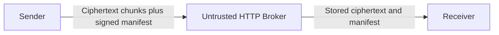

# DESIGN2: Approach B - Encrypted Envelope via Untrusted HTTP Broker

## Goal

Transfer one 4 GB file end-to-end securely even when the storage or relay service is untrusted. This approach uses application-layer security: the sender encrypts the file into independent chunks, signs a manifest, uploads everything to a plain HTTP broker, and the receiver later downloads, verifies, and decrypts the file.

## Trust Setup

Two pinned public keys are distributed out of band. The sender owns an Ed25519 signing keypair, and the receiver pins the sender public key fingerprint. The receiver owns an X25519 keypair, and the sender pins the receiver public key fingerprint. This models fingerprints exchanged in person or printed in project material. No CA and no online key exchange are required.

## Architecture

The sender encrypts the file locally before upload. The broker stores only ciphertext chunks, `manifest.json`, and `manifest.sig`; it performs no authentication and is allowed to be malicious. The receiver verifies the signed manifest before trusting metadata, derives the file key using its X25519 private key, decrypts chunks by index, and verifies the final plaintext hash.



## Envelope Format

For each transfer, the sender generates an ephemeral X25519 keypair and derives a one-time file key:

```text
shared_secret = X25519(sender_ephemeral_secret, receiver_static_public)
file_key = HKDF-SHA256(shared_secret, salt=file_id, info="cmpe272-fk", length=32)
```

The file is streamed in 4 MB plaintext chunks. For chunk `i`, the sender encrypts with AES-256-GCM using `nonce = i.to_bytes(12, "big")` and AAD binding the manifest ID plus chunk index. The manifest records file ID, filename, total size, chunk size, chunk count, per-chunk plaintext SHA-256 values, total plaintext SHA-256, suite IDs, sender ephemeral public key, receiver key fingerprint, and sender signing-key fingerprint. The sender signs canonical manifest JSON with Ed25519.

## CIAA Summary

- Confidentiality: only the receiver with the X25519 private key can derive the AES-GCM file key; the broker sees ciphertext only.
- Integrity: AES-GCM tags detect chunk tampering, signed per-chunk hashes bind plaintext to each chunk index, and the signed whole-file hash detects truncation or missing chunks.
- Authentication: Ed25519 signature verification authenticates the sender; receiver authenticity is cryptographic because only the intended receiver can decrypt.
- Availability: chunks are independent, resumable, and retrievable after the sender goes offline, as long as the broker continues serving stored objects.

## Demo

```bash
make keys
make testfile
python -m approach_b_envelope.broker --bind 127.0.0.1:9080 --store ./broker_store/
python -m approach_b_envelope.sender --broker http://127.0.0.1:9080 --file ./testfile.bin
python -m approach_b_envelope.receiver --broker http://127.0.0.1:9080 --out ./recv_b/testfile.bin
shasum -a 256 ./testfile.bin ./recv_b/testfile.bin
```

## Limitations

A sole malicious broker can deny service by deleting or withholding chunks. The receiver can detect this but cannot force delivery without retries, replication, or another broker. The deterministic nonce scheme is safe only because each file key is derived from a fresh sender ephemeral X25519 key and file ID; key reuse would be forbidden.
